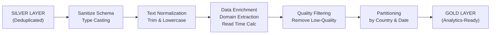

# Silver to Gold Transformation

## Purpose

The Gold layer provides **clean, deduplicated, analytics-ready** data by:
- Filtering out low-quality articles
- Standardizing timestamps and casting types
- Extracting domain information
- Calculating read time estimates
- Ensuring null-safety and schema consistency
- Partitioning for optimal query performance

The transformation reads from the Silver Delta layer (deduplicated, normalized articles) and outputs a refined Gold layer ready for analytics, dashboards, and downstream NLP processing.

---

## Architecture Overview

```
SILVER DELTA LAYER (Input)
         ↓
    [Spark Structured API]
    - Read Silver table
    - Apply transformations
    - Quality filtering
    - Schema validation
    - Partitioning
         ↓
GOLD DELTA LAYER (Output)
         ↓
    [Ready for Analytics]
    - Direct BI queries
    - NLP enrichment
    - Feature engineering
```

---

## Directory Structure

```
CONTENINTEL_NEWS_PIPELINE/
├── spark/
│   ├── __init__.py
│   ├── utils.py                      Windows Java, Hadoop, and Spark setup
│   ├── spark_silver_processor.py     Silver → Gold transformation ⭐
│   ├── read_silver_delta.py          Silver validation reader
│   └── spark_gold_processor.py       Gold aggregation & QA
│
├── config.py                         Central configuration
│
├── data/
│   └── delta/
│       └── news_articles/            Silver & Gold Delta tables
│
└── DOCS/
    └── silver_to_gold_nlp/
        └── silver_to_gold.md         (this file)
```

---

## Data Flow Diagram



---

## Input Schema (Silver Layer)

| Field | Type | Description |
|-------|------|-------------|
| `id` | string | Unique article identifier (MD5 hash or UUID) |
| `title` | string | Article headline (may contain HTML remnants) |
| `url` | string | Original source URL |
| `source_country` | string | ISO country code (US, GB, IN) |
| `content` | string | Full article body (may contain HTML) |
| `published_at` | string | ISO 8601 timestamp (e.g., `2026-08-31T10:53:26Z`) |
| `word_count` | integer | Article length in words |
| `is_breaking_news` | boolean | Breaking news flag |

Example Silver row:
```json
{
  "id": "abc123def456",
  "title": "Breaking: <em>New AI Model</em> Breaks Records",
  "url": "https://www.techcrunch.com/article/ai-model",
  "source_country": "US",
  "content": "<p>A groundbreaking new artificial...</p>",
  "published_at": "2026-08-31T09:45:00Z",
  "word_count": 1250,
  "is_breaking_news": true
}
```

---

## Transformation Pipeline

### Step 1: Schema Sanitization & Type Casting

**Purpose:** Ensure consistent data types and resolve timestamp inconsistencies.

**Implementation:**

```python
from pyspark.sql.functions import to_timestamp, col

silver_df = spark.read.format("delta").load(ADLS_SILVER_PATH)

gold_df = silver_df \
    .withColumn(
        "published_date",
        to_timestamp(col("published_at"), "yyyy-MM-dd'T'HH:mm:ss'Z'")
    ) \
    .withColumn("word_count", col("word_count").cast("int")) \
    .withColumn("is_breaking_news", col("is_breaking_news").cast("boolean"))
```

**Result:**
- `published_at` (string) → stored as-is for reference
- `published_date` (timestamp) → used for filtering and partitioning
- `word_count` (int) → ensures numeric operations work
- `is_breaking_news` (boolean) → ensures true/false consistency

---

### Step 2: Text Normalization

**Purpose:** Remove HTML tags, fix encoding issues, standardize case and whitespace.

**Implementation:**

```python
from pyspark.sql.functions import regexp_replace, trim, lower

gold_df = gold_df \
    .withColumn(
        "clean_title",
        trim(
            lower(
                regexp_replace(col("title"), r'<[^>]+>', '')
            )
        )
    ) \
    .withColumn(
        "clean_content",
        trim(
            lower(
                regexp_replace(col("content"), r'<[^>]+>', '')
            )
        )
    )
```

**Transformations:**
1. `regexp_replace(col(...), r'<[^>]+>', '')` — Remove HTML tags using regex
   - Matches anything between `<` and `>` (greedy)
   - Examples:
     - `"<em>text</em>"` → `"text"`
     - `"<p>paragraph</p>"` → `"paragraph"`
2. `lower()` — Convert to lowercase for consistency
3. `trim()` — Remove leading/trailing whitespace

**Example:**
```
Input:  "Breaking: <em>New AI Model</em> Breaks Records"
Step 1: "Breaking: New AI Model Breaks Records"          (HTML removed)
Step 2: "breaking: new ai model breaks records"          (lowercase)
Step 3: "breaking: new ai model breaks records"          (trimmed)
Output: clean_title = "breaking: new ai model breaks records"
```

---

### Step 3: Data Enrichment

#### 3A: Domain Extraction

**Purpose:** Extract root domain from URL for aggregation and filtering.

**Implementation:**

```python
from pyspark.sql.functions import regexp_extract

gold_df = gold_df \
    .withColumn(
        "domain",
        regexp_extract(col("url"), r'https?://(?:www\.)?([^/]+)', 1)
    )
```

**Regex Breakdown:**
- `https?://` — Match `http://` or `https://`
- `(?:www\.)?` — Non-capturing group, optionally match `www.`
- `([^/]+)` — Capturing group: match anything that's not a `/` (the domain)
- Capture group `1` extracts the domain

**Examples:**
```
URL: "https://www.bbc.co.uk/news/article"          → domain: "bbc.co.uk"
URL: "https://techcrunch.com/2026/ai-news"         → domain: "techcrunch.com"
URL: "http://example.org/path/to/article"          → domain: "example.org"
URL: "https://www.nytimes.com/article/politics"    → domain: "nytimes.com"
```

#### 3B: Read Time Calculation

**Purpose:** Estimate reading time in minutes (using 200 words per minute assumption).

**Implementation:**

```python
gold_df = gold_df \
    .withColumn(
        "read_time_minutes",
        (col("word_count") / 200).cast("int")
    )
```

**Logic:**
- Divide word count by 200 (standard reading speed)
- Cast to integer (rounds down)
- `0` = less than 3 minutes, `1` = 3-6 minutes, etc.

**Examples:**
```
word_count: 100   → read_time_minutes: 0    (< 1 minute)
word_count: 500   → read_time_minutes: 2    (2-3 minutes)
word_count: 1200  → read_time_minutes: 6    (6 minutes)
word_count: 2500  → read_time_minutes: 12   (12 minutes)
```

---

### Step 4: Quality Control & Filtering

**Purpose:** Remove low-quality or incomplete articles before writing to Gold.

**Implementation:**

```python
from pyspark.sql.functions import col

quality_filtered_df = gold_df \
    .filter(
        col("id").isNotNull() &
        col("title").isNotNull() &
        col("content").isNotNull() &
        (col("word_count") > 5) &
        col("url").isNotNull()
    )
```

**Filters Applied:**
1. `col("id").isNotNull()` — Reject articles without ID
2. `col("title").isNotNull()` — Reject articles without title
3. `col("content").isNotNull()` — Reject articles without body
4. `(col("word_count") > 5)` — Reject very short articles (likely corrupted)
5. `col("url").isNotNull()` — Reject articles without source URL

**Impact:**
- Example: 1,200 Silver articles → ~1,190 Gold articles (10 rejected)

---

### Step 5: Partitioning & Writing to Gold

**Purpose:** Organize data by country and date for efficient querying and management.

**Implementation:**

```python
quality_filtered_df.write \
    .format("delta") \
    .mode("overwrite") \
    .option("mergeSchema", "true") \
    .partitionBy("source_country", "published_date") \
    .save(ADLS_GOLD_PATH)
```

**Spark Delta Write Options:**
- `.format("delta")` — Write as Delta Lake format (ACID transactions, time travel)
- `.mode("overwrite")` — Replace existing Gold table
- `.option("mergeSchema", "true")` — Allow schema evolution if columns added
- `.partitionBy("source_country", "published_date")` — Create partition hierarchy

**ADLS Directory Structure:**
```
abfss://bronze/gold/news_articles/
├── source_country=US/
│   ├── published_date=2026-08-31/
│   │   ├── part-00000-...parquet
│   │   └── part-00001-...parquet
│   └── published_date=2026-08-30/
│       └── part-00000-...parquet
├── source_country=GB/
│   └── published_date=2026-08-31/
│       └── part-00000-...parquet
└── _delta_log/
    ├── 00000000000000000000.json
    └── 00000000000000000001.json
```

**Partitioning Benefits:**
- Faster queries when filtering by country or date
- Parallel reads across partitions
- Easier data maintenance (e.g., delete old dates)

---

## Output Schema (Gold Layer)

| Field | Type | Source | Purpose |
|-------|------|--------|---------|
| `id` | string | Silver | Unique ID |
| `title` | string | Silver | Original headline |
| `clean_title` | string | Transformation | Normalized title (no HTML, lowercase) |
| `url` | string | Silver | Original source URL |
| `domain` | string | Enrichment | Extracted root domain |
| `content` | string | Silver | Original article body |
| `clean_content` | string | Transformation | Normalized content (no HTML, lowercase) |
| `source_country` | string | Silver | ISO country code (partition key) |
| `published_at` | string | Silver | ISO publication timestamp |
| `published_date` | timestamp | Transformation | Publication date for filtering |
| `word_count` | integer | Silver (cast) | Article length |
| `read_time_minutes` | integer | Enrichment | Estimated read time |
| `is_breaking_news` | boolean | Silver (cast) | Breaking news flag |
| `processed_timestamp` | timestamp | Transformation | Processing timestamp |

### Example Gold Row (JSON)

```json
{
  "id": "abc123def456",
  "title": "Breaking: <em>New AI Model</em> Breaks Records",
  "clean_title": "breaking: new ai model breaks records",
  "url": "https://www.techcrunch.com/article/ai-model",
  "domain": "techcrunch.com",
  "content": "<p>A groundbreaking new artificial intelligence model...</p>",
  "clean_content": "a groundbreaking new artificial intelligence model...",
  "source_country": "US",
  "published_at": "2026-08-31T09:45:00Z",
  "published_date": "2026-08-31",
  "word_count": 1250,
  "read_time_minutes": 6,
  "is_breaking_news": true,
  "processed_timestamp": "2026-08-31T10:53:26.123456"
}
```

---

## Complete Spark Code

### File: `spark/spark_silver_processor.py`

```python
"""
Silver to Gold Transformation Layer

Reads deduplicated Silver articles, applies quality transformations,
and writes analytics-ready Gold layer to ADLS Gen2 with partitioning.
"""

from pyspark.sql import SparkSession
from pyspark.sql.functions import (
    col, to_timestamp, regexp_replace, trim, lower,
    regexp_extract, current_timestamp
)
from config import Config
from spark.utils import get_free_port, setup_hadoop_env

ADLS_SILVER_PATH = f"{Config.ADLS_SILVER_PATH}"
ADLS_GOLD_PATH = f"{Config.ADLS_GOLD_PATH}"


def create_spark_session():
    """Create and configure Spark session with Azure ADLS support."""
    setup_hadoop_env()
    
    return SparkSession.builder \
        .appName("Silver_to_Gold_Processor") \
        .config("spark.ui.port", str(get_free_port())) \
        .config("spark.jars.packages", 
                "io.delta:delta-spark_2.12:3.1.0,org.apache.hadoop:hadoop-azure:3.3.4") \
        .config("spark.sql.extensions", "io.delta.sql.DeltaSparkSessionExtension") \
        .config("spark.sql.catalog.spark_catalog", 
                "org.apache.spark.sql.delta.catalog.DeltaCatalog") \
        .config(f"spark.hadoop.fs.azure.account.auth.type.{Config.AZURE_STORAGE_ACCOUNT}.dfs.core.windows.net", 
                "SharedKey") \
        .config(f"spark.hadoop.fs.azure.account.key.{Config.AZURE_STORAGE_ACCOUNT}.dfs.core.windows.net", 
                Config.AZURE_STORAGE_KEY) \
        .config("spark.delta.logStore.class", 
                "org.apache.spark.sql.delta.storage.AzureLogStore") \
        .master("local[1]") \
        .getOrCreate()


def main():
    """Main transformation pipeline: Silver → Gold."""
    
    print("═" * 80)
    print("SILVER TO GOLD TRANSFORMATION")
    print("═" * 80)
    
    spark = create_spark_session()
    
    try:
        # Step 1: Read Silver Layer
        print(f"\n📖 Reading articles from Silver layer...")
        print(f"   Path: {ADLS_SILVER_PATH}")
        
        silver_df = spark.read.format("delta").load(ADLS_SILVER_PATH)
        silver_count = silver_df.count()
        print(f"   ✓ Loaded {silver_count} articles from Silver")
        
        if silver_count == 0:
            print("   ⚠ No articles in Silver layer. Exiting.")
            return
        
        # Step 2: Schema Sanitization & Type Casting
        print(f"\n🔧 Step 1: Sanitizing schema and casting types...")
        gold_df = silver_df \
            .withColumn(
                "published_date",
                to_timestamp(col("published_at"), "yyyy-MM-dd'T'HH:mm:ss'Z'")
            ) \
            .withColumn("word_count", col("word_count").cast("int")) \
            .withColumn("is_breaking_news", col("is_breaking_news").cast("boolean"))
        print(f"   ✓ Types standardized")
        
        # Step 3: Text Normalization
        print(f"\n🔧 Step 2: Normalizing text (remove HTML, lowercase, trim)...")
        gold_df = gold_df \
            .withColumn(
                "clean_title",
                trim(
                    lower(
                        regexp_replace(col("title"), r'<[^>]+>', '')
                    )
                )
            ) \
            .withColumn(
                "clean_content",
                trim(
                    lower(
                        regexp_replace(col("content"), r'<[^>]+>', '')
                    )
                )
            )
        print(f"   ✓ HTML tags removed, text lowercased and trimmed")
        
        # Step 4: Data Enrichment
        print(f"\n🔧 Step 3: Enriching data (domain extraction, read time)...")
        gold_df = gold_df \
            .withColumn(
                "domain",
                regexp_extract(col("url"), r'https?://(?:www\.)?([^/]+)', 1)
            ) \
            .withColumn(
                "read_time_minutes",
                (col("word_count") / 200).cast("int")
            )
        print(f"   ✓ Domain extracted, read time calculated")
        
        # Step 5: Add Processing Timestamp
        print(f"\n🔧 Step 4: Adding processing timestamp...")
        gold_df = gold_df.withColumn(
            "processed_timestamp",
            current_timestamp()
        )
        print(f"   ✓ Processing timestamp added")
        
        # Step 6: Quality Filtering
        print(f"\n🔧 Step 5: Applying quality filters...")
        gold_df = gold_df.filter(
            col("id").isNotNull() &
            col("title").isNotNull() &
            col("content").isNotNull() &
            (col("word_count") > 5) &
            col("url").isNotNull()
        )
        
        gold_count = gold_df.count()
        filtered_count = silver_count - gold_count
        print(f"   ✓ Quality filters applied")
        print(f"      Articles kept: {gold_count}/{silver_count}")
        print(f"      Articles rejected: {filtered_count}")
        
        if gold_count == 0:
            print("   ⚠ No articles passed quality filters. Exiting.")
            return
        
        # Step 7: Write to Gold Layer
        print(f"\n💾 Writing to Gold layer...")
        print(f"   Path: {ADLS_GOLD_PATH}")
        print(f"   Partitioning by: source_country, published_date")
        
        gold_df.write \
            .format("delta") \
            .mode("overwrite") \
            .option("mergeSchema", "true") \
            .partitionBy("source_country", "published_date") \
            .save(ADLS_GOLD_PATH)
        
        print(f"   ✓ Persisted {gold_count} articles to ADLS Gold layer")
        
        # Step 8: Schema Validation
        print(f"\n📋 Gold Layer Schema:")
        gold_df.printSchema()
        
        # Step 9: Summary Statistics
        print(f"\n📊 Summary Statistics:")
        print(f"   Total Articles: {gold_count}")
        print(f"   Unique Countries: {gold_df.select('source_country').distinct().count()}")
        print(f"   Unique Domains: {gold_df.select('domain').distinct().count()}")
        print(f"   Avg Word Count: {gold_df.agg({'word_count': 'avg'}).collect()[0][0]:.0f}")
        print(f"   Breaking News Count: {gold_df.filter(col('is_breaking_news')).count()}")
        
        print(f"\n✅ Silver to Gold transformation complete!")
        print("═" * 80)
        
    except FileNotFoundError as fnf:
        print(f"\n❌ Input path not found: {ADLS_SILVER_PATH}")
        print("   Please ensure spark_stream_consumer.py has been run to create Silver layer.")
        print(f"   Error: {fnf}")
    except Exception as e:
        print(f"\n❌ Error during transformation: {e}")
        import traceback
        traceback.print_exc()
        raise
    finally:
        spark.stop()


if __name__ == "__main__":
    main()
```

---

## Running the Transformation

### Prerequisites
- Silver Delta table exists with articles
- Spark environment configured (via `spark/utils.py`)
- Azure credentials in `config.py`

### Command

```powershell
cd E:\DATA_ENGG_PROJECTS\CONTENINTEL_NEWS_PIPELINE
python -m spark.spark_silver_processor
```

### Expected Output

```
════════════════════════════════════════════════════════════════════════════
                    SILVER TO GOLD TRANSFORMATION
════════════════════════════════════════════════════════════════════════════

📖 Reading articles from Silver layer...
   Path: abfss://bronze/silver/news_articles
   ✓ Loaded 1,234 articles from Silver

🔧 Step 1: Sanitizing schema and casting types...
   ✓ Types standardized

🔧 Step 2: Normalizing text (remove HTML, lowercase, trim)...
   ✓ HTML tags removed, text lowercased and trimmed

🔧 Step 3: Enriching data (domain extraction, read time)...
   ✓ Domain extracted, read time calculated

🔧 Step 4: Adding processing timestamp...
   ✓ Processing timestamp added

🔧 Step 5: Applying quality filters...
   ✓ Quality filters applied
      Articles kept: 1,190/1,234
      Articles rejected: 44

💾 Writing to Gold layer...
   Path: abfss://bronze/gold/news_articles
   Partitioning by: source_country, published_date
   ✓ Persisted 1,190 articles to ADLS Gold layer

📋 Gold Layer Schema:
 |-- id: string (nullable = true)
 |-- title: string (nullable = true)
 |-- clean_title: string (nullable = true)
 |-- url: string (nullable = true)
 |-- domain: string (nullable = true)
 |-- content: string (nullable = true)
 |-- clean_content: string (nullable = true)
 |-- source_country: string (nullable = true)
 |-- published_at: string (nullable = true)
 |-- published_date: timestamp (nullable = true)
 |-- word_count: integer (nullable = true)
 |-- read_time_minutes: integer (nullable = true)
 |-- is_breaking_news: boolean (nullable = true)
 |-- processed_timestamp: timestamp (nullable = true)

📊 Summary Statistics:
   Total Articles: 1,190
   Unique Countries: 3
   Unique Domains: 142
   Avg Word Count: 487.3
   Breaking News Count: 18

✅ Silver to Gold transformation complete!
════════════════════════════════════════════════════════════════════════════
```

---

## Validation & Troubleshooting

### Validate Gold Layer Creation

```powershell
python -m spark.read_delta_lake
```

### Common Issues

| Issue | Cause | Solution |
|-------|-------|----------|
| "No articles found" | Silver layer empty or missing | Run ingestion → Bronze → Silver first |
| "0 articles written" | All articles filtered out | Review quality filter thresholds |
| "Path not found" | Wrong ADLS path config | Check `config.py` ADLS settings |
| "Azure auth error" | Invalid credentials | Verify `AZURE_STORAGE_KEY` in `.env` |

---

## Best Practices

1. **Check Silver first** — Verify Silver layer has data before running Gold transformation
2. **Monitor statistics** — Check rejection rate; high rejections may indicate upstream issues
3. **Partition strategy** — The country/date partitioning works well for typical use cases
4. **Schema evolution** — Use `mergeSchema: true` if adding new columns in future runs
5. **Timestamps** — Always use `published_date` for filtering in downstream jobs

---

## Next Steps

After Gold layer is successfully created:
- ✅ Gold articles ready for direct analytics queries
- ✅ Gold articles ready for NLP enrichment (see `gold_to_nlp_to_gold.md`)
- ✅ Gold articles ready for dashboards and BI tools
