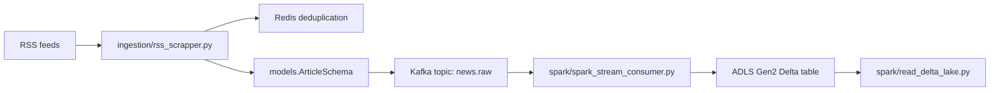

# ContentIntel News Pipeline

## Purpose

This project collects news articles from RSS feeds, removes duplicates with Redis, publishes article events to Kafka, processes the stream with PySpark, and stores Delta Lake data in Azure Data Lake Storage Gen2 (ADLS Gen2).

## Directory Structure

```text
CONTENINTEL_NEWS_PIPELINE/
├── .env                         Local secrets and runtime configuration
├── .gitignore                   Files excluded from Git
├── config.py                    Central application configuration
├── models.py                    Shared Kafka article schema
├── docker-compose.yml           Local Kafka and Redis services
├── requirements.txt             Python dependencies
│
├── ingestion/
│   ├── __init__.py
│   ├── rss_scrapper.py          RSS polling and article extraction
│   ├── redis_client.py          Redis deduplication client
│   └── kafka_producer.py        Kafka publisher
│
├── spark/
│   ├── __init__.py
│   ├── utils.py                 Windows Java, Hadoop, and Spark setup
│   ├── spark_stream_consumer.py Kafka-to-ADLS streaming job
│   └── read_delta_lake.py       ADLS Delta validation reader
│
├── .hadoop/bin/
│   ├── winutils.exe             Windows Hadoop utility
│   └── hadoop.dll               Windows Hadoop native library
│
├── data/                        Previous local Delta/checkpoint data
└── DOCS/                        Project documentation and architecture image
```

## End-to-End Flow



## Root Files

### `.env`

Contains local runtime values. It supplies Kafka, Redis, and Azure settings to `config.py` through `python-dotenv`.

Required Azure values:

```env
AZURE_STORAGE_ACCOUNT=<storage account name>
AZURE_STORAGE_KEY=<storage account access key>
AZURE_CONTAINER=bronze
```

The storage key is an Azure Storage Account access key, not a connection string. Never commit `.env` or expose the key in logs.

### `.gitignore`

Excludes secrets, the virtual environment, Hadoop binaries, generated data, Delta files, Python caches, and IDE files.

### `config.py`

Loads `.env` and exposes the `Config` class. It defines:

- `KAFKA_BOOTSTRAP_SERVERS`: Kafka address, normally `localhost:9092`
- `REDIS_HOST` and `REDIS_PORT`: Redis connection
- `AZURE_STORAGE_ACCOUNT`, `AZURE_STORAGE_KEY`, `AZURE_CONTAINER`: ADLS credentials
- `ADLS_BRONZE_PATH`: `abfss://.../news_articles`
- `ADLS_CHECKPOINT_PATH`: `abfss://.../checkpoints/news_raw`
- `RSS_FEEDS`: country-to-feed mapping
- `SCRAPER_INTERVAL_SECONDS`: scraper wait time between cycles

All application modules import their runtime settings from this file.

### `models.py`

Defines `ArticleSchema`, the Pydantic model used by the scraper and Kafka producer. Current payload fields are:

- `id`
- `title`
- `url`
- `source_country`
- `content`
- `published_at`
- `word_count`
- `is_breaking_news`

The model is validated before an article is sent to Kafka.

### `docker-compose.yml`

Starts local infrastructure:

- Redis container `contentintel_redis` on port `6379`
- Kafka container `contentintel_kafka` on port `9092`

## Ingestion Package

### `ingestion/rss_scrapper.py`

Main ingestion orchestrator.

1. Reads `Config.RSS_FEEDS`.
2. Parses each RSS feed with `feedparser`.
3. Creates an MD5 hash from each article URL.
4. Calls `RedisClient.is_duplicate()`.
5. Downloads article HTML with `httpx`.
6. Extracts readable article text with `trafilatura`.
7. Builds and validates `ArticleSchema`.
8. Sends the article to Kafka topic `news.raw`.
9. Waits `Config.SCRAPER_INTERVAL_SECONDS` and repeats.

It is asynchronous and should be started as a module from the project root:

```powershell
python -m ingestion.rss_scrapper
```

### `ingestion/redis_client.py`

Uses `redis.asyncio`. `is_duplicate()` atomically stores `scraped:<url_hash>` with a seven-day TTL using Redis `SETNX` behavior.

- Returns `False` for a new URL and records it.
- Returns `True` when the URL was already seen.

### `ingestion/kafka_producer.py`

Wraps `AIOKafkaProducer`.

- Connects to `Config.KAFKA_BOOTSTRAP_SERVERS`.
- Serializes `ArticleSchema.model_dump()` as JSON.
- Uses `source_country` as the Kafka message key.
- Publishes to the topic supplied by the scraper, currently `news.raw`.

## Spark Package

### `spark/utils.py`

Provides Windows runtime setup:

- Sets `HADOOP_HOME` to the project `.hadoop` directory.
- Prepends `.hadoop/bin` to `PATH`.
- Finds a valid Java installation when `JAVA_HOME` is stale or missing.
- Replaces an invalid `SPARK_HOME` with the PySpark package location.

Both Spark programs call these helpers before initializing Spark.

### `spark/spark_stream_consumer.py`

Reads Kafka and writes Delta directly to ADLS Gen2.

1. Loads Azure credentials from `Config`.
2. Requires a non-empty, non-placeholder storage account and key.
3. Loads Delta, Kafka, and Hadoop Azure JAR packages.
4. Configures SharedKey authentication with:
   `spark.hadoop.fs.azure.account.key.<account>.dfs.core.windows.net`
5. Reads Kafka topic `news.raw` from the earliest offset.
6. Parses JSON into a Spark schema.
7. Adds `processed_timestamp`.
8. Writes append-only Delta data to `Config.ADLS_BRONZE_PATH`.
9. Stores streaming checkpoints at `Config.ADLS_CHECKPOINT_PATH`.

Run from the project root:

```powershell
python -m spark.spark_stream_consumer
```

The process is continuous and must remain running.

### `spark/read_delta_lake.py`

Creates a Spark session with the same ADLS SharedKey configuration and reads `Config.ADLS_BRONZE_PATH` as Delta. It prints the total row count and sample columns.

Run after the consumer has created the remote table:

```powershell
python -m spark.read_delta_lake
```

If the path does not exist, the consumer has not yet written a Delta table to Azure, or the container/path/account configuration is incorrect.

## Normal Startup Order

Start Docker services first:

```powershell
docker compose up -d
```

Terminal 1, keep running:

```powershell
python -m spark.spark_stream_consumer
```

Terminal 2, keep running:

```powershell
python -m ingestion.rss_scrapper
```

Terminal 3, run when validation is needed:

```powershell
python -m spark.read_delta_lake
```

## Operational Notes

- Use the project virtualenv interpreter: `\.venv\Scripts\python.exe` if activation is unreliable.
- Run module commands from the project root so package-relative imports work.
- Run only one scraper and one Spark consumer. Multiple copies can compete for Redis keys and streaming checkpoints.
- `SparkUI` port fallback warnings are normally harmless.
- Windows temporary JAR cleanup warnings can be harmless after a reader exits.
- Clearing Redis with `docker exec contentintel_redis redis-cli FLUSHDB` causes existing RSS entries to be treated as new again.
- The current Spark schema accepts both current fields and legacy fields. Existing legacy rows may have null `word_count` and `is_breaking_news`; future payloads from the current scraper provide those fields.


=======================================================
                 CONTENTINTEL NEWS PIPELINE: BRONZE INGESTION ARCHITECTURE
                 =======================================================

+------------------+
|   RSS Sources    |
| (US, UK, India)  |
+--------+---------+
         |
         | 1. Poll RSS feeds
         v
+-------------------------------------------------------------------------+
|                         Ingestion Package                               |
|                     (ingestion/rss_scrapper.py)                         |
|                                                                         |
|  +--------------------+             +--------------------------------+  |
|  |   ingestion/       |  2. Check   |          Infrastructure        |  |
|  |   redis_client.py  +------------>|  +--------------------------+  |  |
|  |   (Deduplication)  |  Set (TTL)  |  | Redis Container          |  |  |
|  +---------+----------+             |  | (port 6379)              |  |  |
|            |                        |  +--------------------------+  |  |
|            | 3. Pass non-duplicate  |                                |  |
|            v                        |  +--------------------------+  |  |
|  +--------------------+             |  | Kafka Container          |  |  |
|  | models.py          |             |  | (port 9092)              |  |  |
|  | (ArticleSchema)    |             |  +-------------+------------+  |  |
|  +---------+----------+             +----------------|---------------+  |
|            |                                         |                  |
|            | 4. Validate & Serialize JSON            |                  |
|            v                                         v                  |
|  +--------------------+  5. Publish Topic    +---------------+          |
|  |   ingestion/       |--------------------->| Topic:        |          |
|  |   kafka_producer.py|  "news.raw"          | news.raw      |          |
|  +--------------------+                      +-------+-------+          |
+------------------------------------------------------|------------------+
                                                       |
                                                       | 6. Structured Stream
                                                       v
+-------------------------------------------------------------------------+
|                           Spark Package                                 |
|                  (spark/spark_stream_consumer.py)                       |
|                                                                         |
|  +------------------+      Imports       +---------------------------+  |
|  | spark/utils.py   +------------------->| Windows Compatibility     |  |
|  | (Env & Paths)    |                    | (.hadoop/bin/winutils.exe |  |
|  +------------------+                    |  .hadoop/bin/hadoop.dll)  |  |
|                                          +---------------------------+  |
|                                                                         |
|  +-------------------------------------------------------------------+  |
|  | PySpark Structured Streaming + Delta Engine                       |  |
|  | Configured via config.py (Azure SharedKey Auth)                   |  |
|  +----------------------------------+--------------------------------+  |
+-------------------------------------|-----------------------------------+
                                      |
                                      | 7. Persist ACID Micro-batches
                                      v
+-------------------------------------------------------------------------+
|                AZURE ADLS GEN2 STORAGE LAYER (BRONZE)                   |
|                  Container Name: `bronze`                               |
|                                                                         |
|  [ADLS_CHECKPOINT_PATH]               [ADLS_BRONZE_PATH]                |
|  abfss://.../checkpoints/news_raw     abfss://.../news_articles         |
|                                                                         |
|                                         ├── _delta_log/                 |
|                                         │   ├── 00000000000000000000.json|
|                                         │   └── 00000000000000000001.json|
|                                         ├── part-00000-....parquet      |
|                                         └── part-00001-....parquet      |
+-------------------------------------------------------------------------+
                                      ^
                                      | 8. Query & Validate
                                      |
                           +----------+----------+
                           |    spark/           |
                           |    read_delta_lake.py|
                           +---------------------+