# 📰 ContentIntel — End-to-End News Data Engineering & AI/NLP Pipeline


An **enterprise-grade Data Engineering & NLP Intelligence Platform** built around a **Medallion Lakehouse Architecture (Bronze → Silver → Gold)**, **Apache Airflow Orchestration**, **Qdrant Vector DB Semantic Search**, a **9-Task Local NLP Pipeline**, and an interactive **Streamlit Analytics Dashboard**.

---

## 🏗️ System Overview & Architecture

Below is the architecture overview in sleek dark theme showing the **Airflow Pipeline DAG Orchestration (with tech stack symbols)**, **Technologies Stack**, and **Core Data Engineering Concepts**.

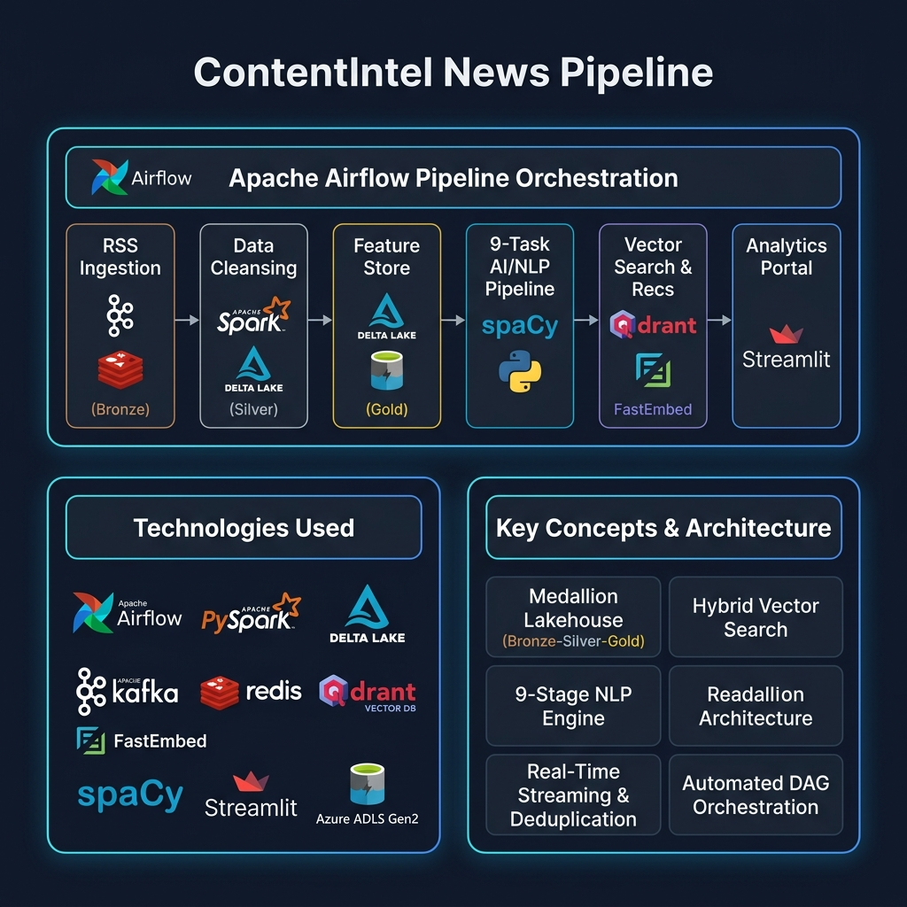

---

## 📚 Detailed Pipeline Breakdown (Part-by-Part)

---

### 🔹 Part 1: Ingestion & Azure Bronze Layer
In the first phase of the pipeline, RSS feeds from multiple global news sources (US, UK, India) are polled asynchronously.
- **URL Deduplication**: Uses Redis to store url hashes and eliminate duplicate articles before pushing to Kafka.
- **Kafka Producer**: Publishes validated raw JSON payloads to the `news.raw` Kafka topic.
- **Bronze Storage**: Spark continuous stream consumer (`spark_stream_consumer`) writes raw records directly to Azure ADLS Gen2 Delta Lake (`abfss://bronze/...`).


#### RSS Feed Ingestion Detail
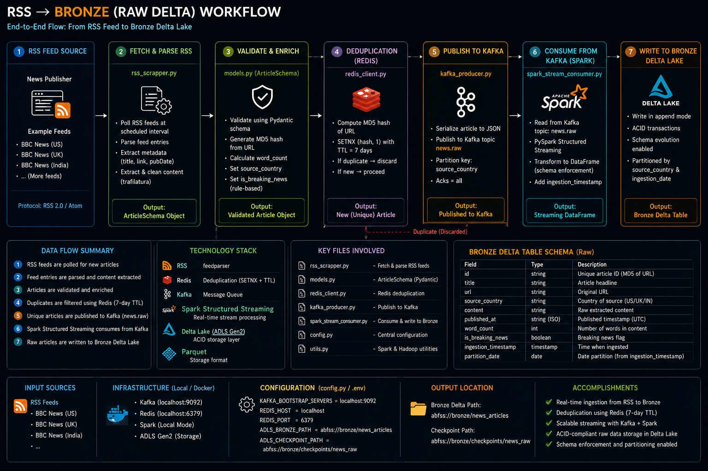

---

### 🔹 Part 2: Bronze to Silver Data Cleansing Layer
The Silver processing layer standardizes, cleanses, and quality-checks the raw Bronze Delta records:
- Removes HTML tags and cleans unneeded formatting using regex.
- Standardizes timestamps to ISO format and computes word counts & estimated reading times.
- Filters out low-quality or short articles (`word_count < 30`).
- Writes cleaned records into Silver Delta Lake (`abfss://silver/...`) partitioned by `source_country` and `published_date`.

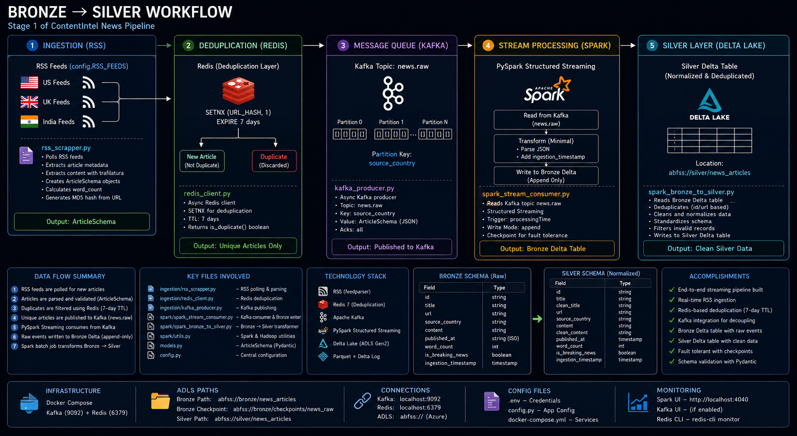

---

### 🔹 Part 3: Silver to Gold Feature Store & Aggregations Layer
The Gold layer prepares business-ready analytical datasets and features for downstream NLP and vector indexing:
- Generates publisher domain metrics, country aggregates, and breaking news indicators.
- Creates `nlp_input_articles` Delta tables in Gold ADLS storage (`abfss://gold/...`).

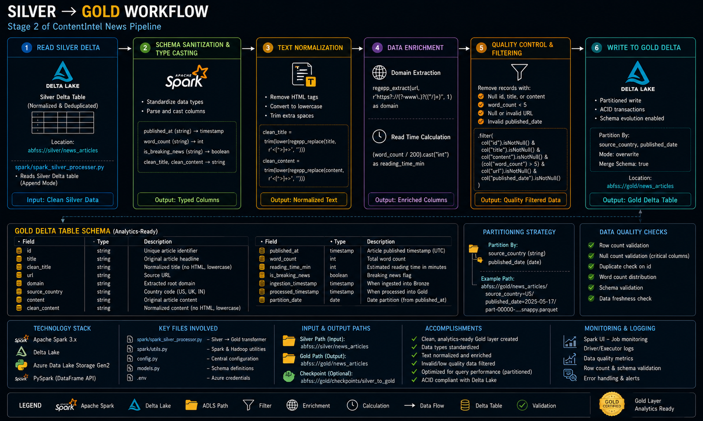

---

### 🔹 Part 4: 9-Task NLP Enrichment Engine
The Gold layer articles are processed through an intensive **9-Task Local CPU NLP Pipeline**:

1. **Text Preprocessing**: Normalizes whitespace & fixes unicode text encoding with `ftfy`.
2. **Language Detection**: Identifies language using FastText (`fast_langdetect`).
3. **Machine Translation**: Offline translation (`argostranslate`) to convert non-English text to English.
4. **Named Entity Recognition (NER)**: spaCy (`en_core_web_sm`) extracting 15+ entity types (`PERSON`, `ORG`, `GPE`, `DATE`, `MONEY`).
5. **Location Verification**: Geopolitical entity cross-referencing against `geonamescache` (11.5M+ global places).
6. **Category Classification**: Keyword scoring into Technology, Business, Politics, Sports, General.
7. **Keyword Extraction**: Term frequency ranking with candidate filtering.
8. **Extractive Summarization**: Graph-based `sumy` LexRankSummarizer producing a 2-sentence summary without hallucination.
9. **Sentiment Analysis**: `nltk` VADER Sentiment Intensity Analyzer (Polarity score & Label).

Enriched output is staged locally as JSONL files (`data/nlp_enriched/`) and saved back to Gold Delta Lake (`save_nlp_to_gold.py`).

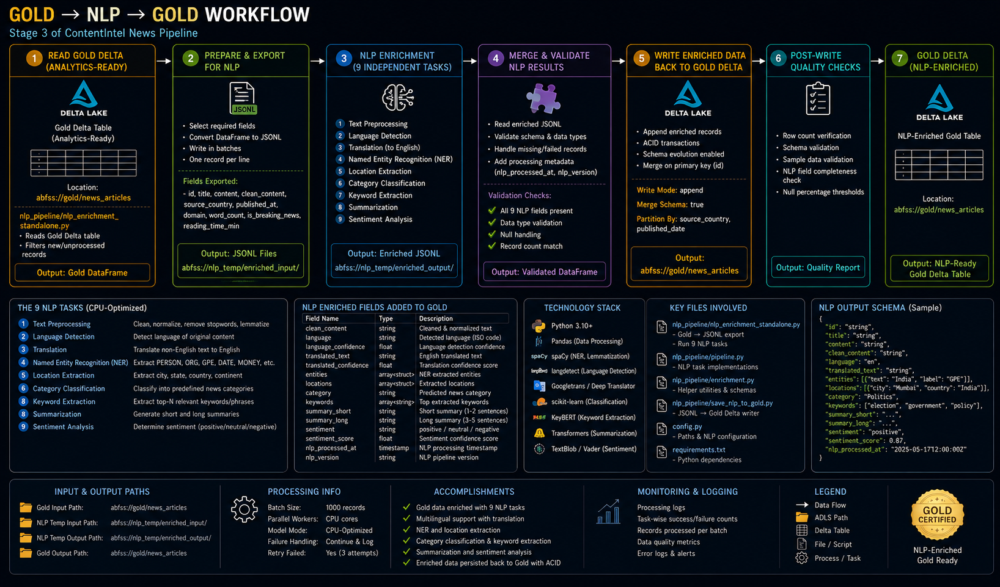

---

### 🔹 Part 5: Qdrant Vector Search Engine
The enriched JSONL files are vectorized using **FastEmbed** (`BAAI/bge-small-en-v1.5`, 384-dimensional dense vectors) and indexed into **Qdrant Vector Database**:
- Stores vector embeddings alongside rich metadata payloads (sentiment label, entities, category, country).
- Supports **Hybrid Search** (combining dense vector similarity queries with category/country metadata filters).

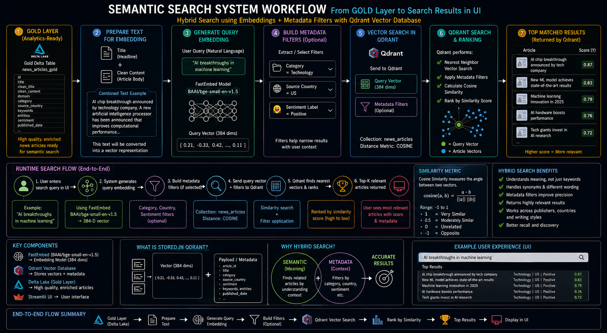

---

### 🔹 Part 6: Recommendation Engine & Discovery Loop
Given an active article, the recommendation engine finds semantically similar story vectors in the embedding space:
- Computes cosine similarity across 384-dim vector neighborhoods in Qdrant.
- Supports optional category biasing to surface related stories within the same domain.

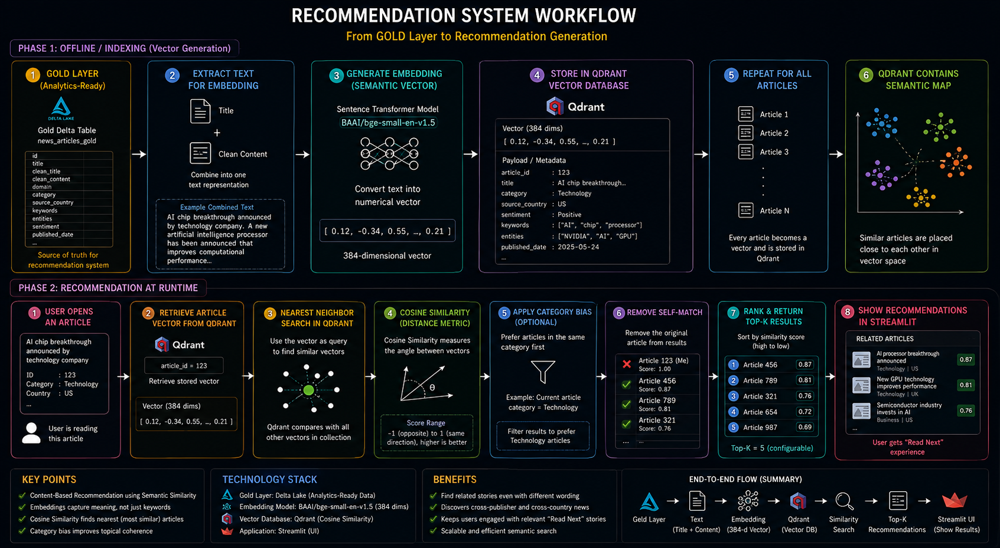

---

### 🔹 Part 7: Gold Data to Streamlit Analytics Portal
The final output is connected directly to an interactive dual-view Streamlit portal (`app.py`), combining analytical metrics, live vector search, 9-task NLP breakdown reports, and recommendation cards.

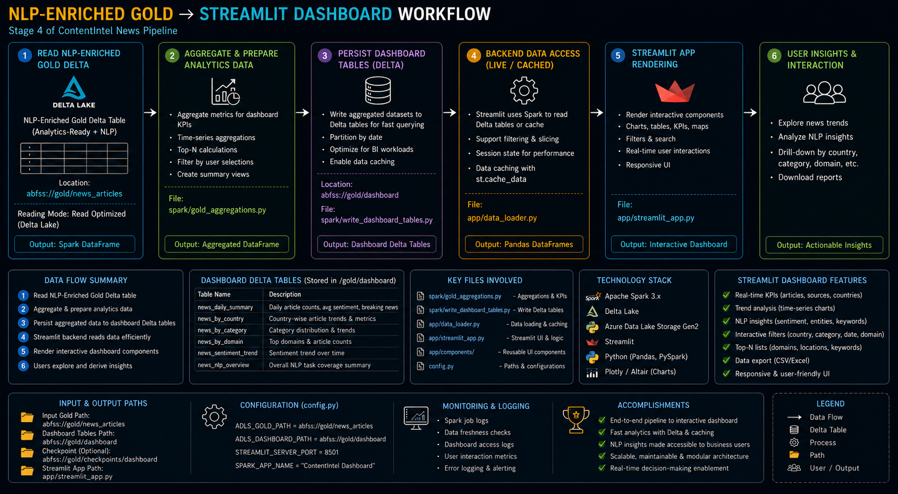

---

## 🖥️ Streamlit Analytics Dashboard Screenshots

### 1. Full Article Text & NLP Preview
Users can read the full cleaned news payload and preview the initial metadata breakdown.
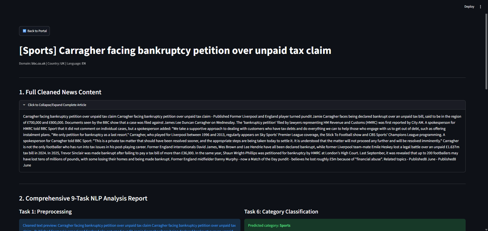

### 2. Comprehensive 9-Task NLP Analysis Report
Visualizes all 9 NLP task outputs including NER tags, verified locations, LexRank summary, and Plotly VADER sentiment gauge indicator (-1.0 to +1.0).
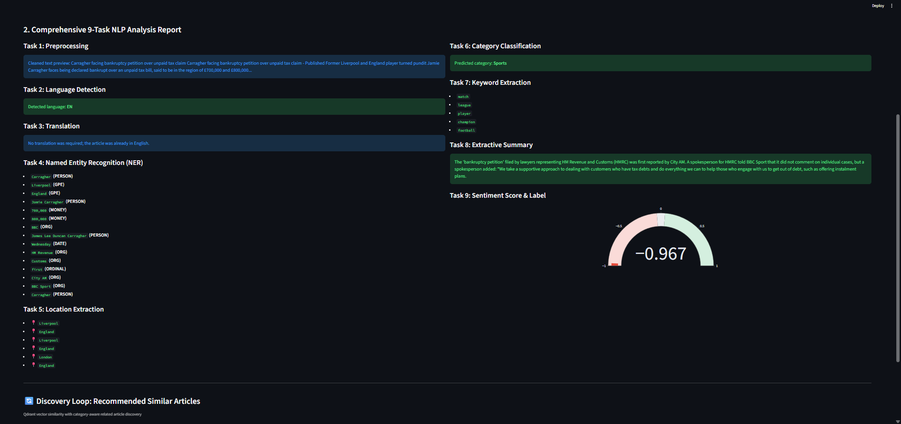

### 3. Qdrant Semantic Search Results
Interactive natural-language semantic query search bar powered by Qdrant vector similarity.
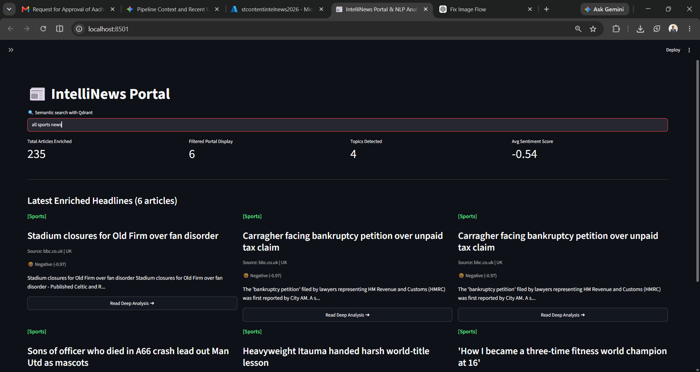

### 4. Recommendation Discovery Loop (Related Articles)
Real-time vector match scores for similar articles with one-click navigation to analyze the recommended article next.
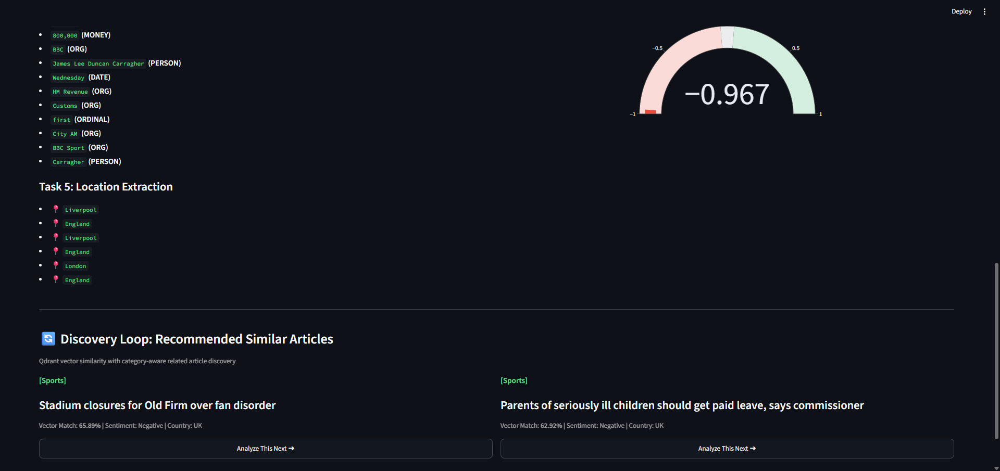

---

## ⚡ Apache Airflow Pipeline Orchestration

The entire 5-stage pipeline is automated using an hourly **Apache Airflow DAG** (`contentintel_news_pipeline`):

```
┌───────────────────────┐
│ ingest_rss_to_bronze  │  (Fetch RSS feeds & Bronze ingestion)
└───────────┬───────────┘
            │
            ▼
┌───────────────────────┐
│process_bronze_to_silver│ (PySpark Silver cleaning & schema sanitization)
└───────────┬───────────┘
            │
            ▼
┌───────────────────────┐
│ process_silver_to_gold│ (PySpark Gold analytics & nlp_input tables)
└───────────┬───────────┘
            │
            ▼
┌───────────────────────┐
│  run_nlp_enrichment   │ (9-Task local NLP enrichment -> JSONL output)
└───────────┬───────────┘
            │
            ▼
┌───────────────────────┐
│    index_to_qdrant    │ (Qdrant vector indexing BAAI/bge-small-en-v1.5)
└───────────────────────┘
```

---

## 📁 Project Directory Structure

```
ContentIntel News Pipeline/
│
├── 📁 bronze/                           # Raw Ingestion Layer
│   └── ingestion/
│       ├── fetch_rss.py                 # Async RSS feed fetcher
│       ├── kafka_producer.py            # Streaming producer to Kafka
│       ├── redis_client.py              # Redis URL deduplication client
│       └── rss_scrapper.py              # Web scraping utilities
│
├── 📁 silver/                           # Cleaned & Normalized Data Layer
│   └── processors/
│       └── spark_silver_processor.py    # PySpark Bronze -> Silver transformation
│
├── 📁 gold/                             # Business-Ready Enriched Layer
│   └── processors/
│       ├── spark_gold_processor.py      # PySpark Silver -> Gold aggregates & NLP features
│       └── read_delta_lake.py           # Delta Lake reading utilities
│
├── 📁 nlp_news/                         # 9-Task NLP Pipeline
│   ├── pipeline.py                      # Core 9-task NLP orchestrator
│   ├── nlp_enrichment_standalone.py     # Standalone local processor (JSONL output)
│   └── save_nlp_to_gold.py              # Persist enriched results to Delta Lake
│
├── 📁 searching/                        # Vector Database Indexer
│   └── indexer.py                       # FastEmbed + Qdrant vector indexer
│
├── 📁 recommendation/                   # Hybrid Search & Recommendation Engine
│   └── search_recommendations.py        # Qdrant hybrid search & related article discovery
│
├── 📁 dags/                             # Airflow Orchestration
│   └── news_pipeline_dag.py             # 5-stage automated DAG definition
│
├── 📁 DOCS/                             # Documentation & Architecture Diagrams
│   ├── AIRFLOW_ORCHESTRATION.md         # Airflow setup & monitoring guide
│   └── DATA_ENGINEERING_SHOWCASE.md     # Resume bullet points & interview guide
│
├── 📄 app.py                            # Streamlit Analytics Dashboard
├── 📄 config.py                         # Central configuration
├── 📄 models.py                         # Pydantic data schemas
├── 📄 docker-compose.yml                # Docker stack (Redis, Kafka, Qdrant, Airflow, Postgres)
├── 📄 PIPELINE_COMMANDS.md              # Execution manual
└── 📄 requirements.txt                  # Python dependencies
```

---

## 🚀 Quick Start & Execution

### 1. Start Services via Docker Compose
```powershell
docker compose up -d
```
Starts Redis, Kafka, Qdrant, Postgres, Airflow Webserver (Port `8080`), and Airflow Scheduler.

### 2. Access Airflow Web UI
- **URL**: [http://localhost:8080](http://localhost:8080)
- **Login**: Username: `admin` | Password: `admin`
- Unpause **`contentintel_news_pipeline`** and click **Trigger DAG**.

### 3. Run Streamlit Dashboard
```powershell
streamlit run app.py
```
Open browser: [http://localhost:8501](http://localhost:8501)

---

## 📄 License
This project is licensed under the MIT License - see the `LICENSE` file for details.
